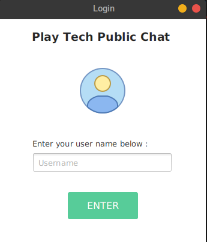
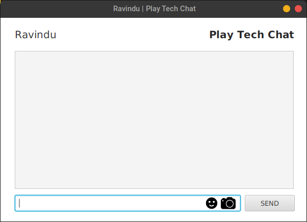
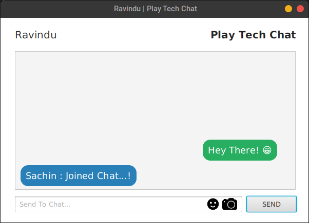
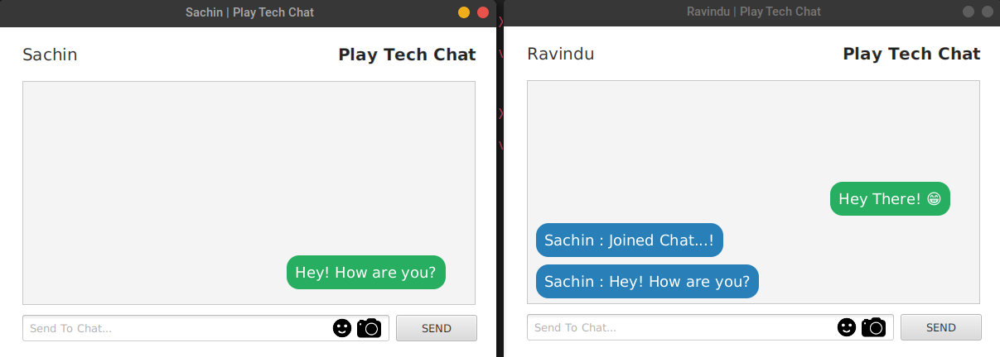

## STANDALONE CHAT APPLICATION
<code>java</code> <code>javaFX</code> <code>java-socket</code>

* This is course work for the Internet Network Programming Module.

#### Login Page

> Users can enter a username as it will display to others in group chat.
> Can use letters number and characters for the username.

 

#### Chat Interface

> Users can enter their username and login to the chat application.
> Afte that they can use emoji and text to chat in the group chat.

  
  
#### Multiple Client Chat
  
  
  > This chat system can handle multiple clients at the same time as shown in the screenshot.